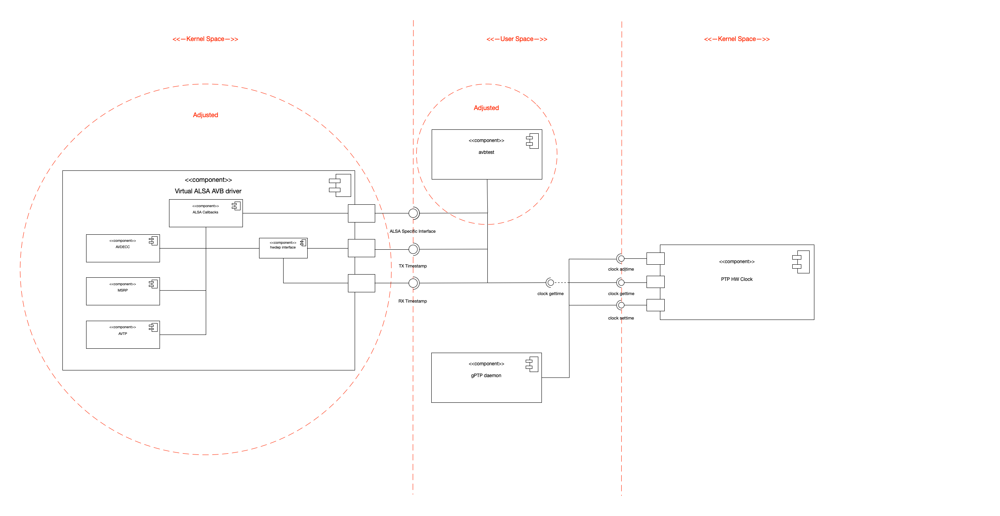

# AVB Alsa driver

## Introduction
The Alsa AVB driver is based on the Implemenatation of [indu](https://github.com/induarun9086) and consists of three modules.
The IEEE 802.1-AS protocol (gPTP) is implemented in the gPTP User Space daemon. The IEEE 1722-2011 Layer 2 (AVTP), 
IEEE 1722.1-2013 (AVDECC) and IEEE 802.1Qat-2010 (MSRP) protocols are implemented in the virtual ALSA AVB driver. A file 
can be played back using the AVB-Test application.
The project objective is to port and refactor/modularize the ALSA AVB driver including the two user applications to the Beaglebone AI using kernel 
version 5.4-RT.

## Architecture
The basic structure of the AVB kernel space and user space modules can be seen in the following component diagram.

The straight dashed red lines show the borders between User and Kernel Space. The components, which needed adjustments are marked with dashed red circles. For the user space modules just the avbtest application needed adjustments to allow playback of received audio data via the HDMI port of the BBAI.
The kernel space module needed some adjustments, which are specifically described in [Adjustments](##Adjustments).

## Adjustments
Here the most prominent changes are shown, which needed adjustments, for successfully porting the AVB ALSA driver to the 5.4-RT kernel on BBAI.

### Modularization and Refactoring
The source code of [indu](https://github.com/induarun9086) was seperated into different files, to improve readability and separation of source code. Therefore, the AVTP, the MSRP and the AVDECC protocols have been split into several files. This also required some small changes within interface definitions. Additionally, a common utility header was introduced, which implements functionality and macros, which are used in several modules.
To seperate the avb driver from other ALSA driver, the implementation directory was changed to ```/linux/sound/drivers/avb```.
Also the whole codebase was inspected and code was changed to conform to linux kernel coding conventions.

### Abstraction of PTP HW clock (Not included in final submission)
Additionally some research was conducted in how to access the PTP hardware clock of the NIC, if one is available. On TI devices this is done via the CPTS module. To abstract access away for other NIC's an abstraction layer was implemented, which can be found [here](https://github.com/NiklasWan/linux/tree/dev_gsoc_backup_hw_gptp/sound/drivers/avb). The abstraction is done in ```avb_hwclock.h``` and ```avb_hwclock.c```, ```ti_hwclock.c```implements this interface for ti devices.
At first it was planned to implement synchronisation of different audio streams in kernel space but due to the fact, that we want to playback audio to different devices, we can't handle this in kernel space. Because of that we decided to not use the PTP HW clock in kernel space.

### Porting the gPTP User Space daemon to the kernel space (Not included in final submission)
Also some time was invested in trying to port the gPTP daemon to Kernel Space. This however failed, because I was not able to access the CMSGHDR data, for accessing the TX hardware timestamps. All other parts however are working fine in kernel space and can be found [here](https://github.com/NiklasWan/linux/tree/dev_avb_5.4-rt/drivers/net/gptp).
If you want to continue working on porting this to kernel space, take a look [here](https://github.com/NiklasWan/linux/blob/dev_gsoc_backup_hw_gptp/drivers/net/gptp/gptp_common.c). The functions, ```void get_rx_ts(struct gptp_instance* gptp, struct timespec64* ts)``` and ```void get_tx_ts(struct gptp_instance* gptp, struct timespec64* ts)```are causing the issues in accessing the CMSGHDR of a packet. Maybe somone can find a way to access the timestamp information.

### Changed snd_pcm_hardware description of playback capture device.

Here the ```.periods_min``` parameter was adjusted, to adjust the minimum length of pcm interrupts. This was needed due some overrun issues while playing back and recording audio data with the AVB sound card.

The following listing shows the resulting structure for the playback hardware, which is redundant to the capture hardware.
```C
static struct snd_pcm_hardware avb_playback_hw = {
	.info				= (SNDRV_PCM_INFO_INTERLEAVED |
							SNDRV_PCM_INFO_BLOCK_TRANSFER),
	.formats			= SNDRV_PCM_FMTBIT_S16_LE,
	.rates				= SNDRV_PCM_RATE_8000_192000,
	.rate_min			= 8000,
	.rate_max			= 192000,
	.channels_min		= 1,
	.channels_max		= 8,
	.buffer_bytes_max 	= 131072,
	.period_bytes_min	= 16384,
	.period_bytes_max	= 131072,
	.periods_min		= 2,
	.periods_max 		= 4,
};
```

### Changed snd_pcm_ops copy function
Because of API changes between kernel version  4.4 and 5.4, the playback and capture copy function needed some adjustments.
One point is, that in kernel version 5.4 the count of data to copy and the position in the buffer are no longer passed in number of frames but instead the number of bytes are passed. So the parameters needed to be calculated in frames first to allow for expected behavior. The second point was, that the member of ```snd_pcm_ops``` which handles copying between user and kernel space now was renamed to ```.copy_user```.

### Changed to kernel sockets
The socket communication was changed to the kernel space sockets. So now all functions from [linux/net.h](https://elixir.bootlin.com/linux/latest/source/include/linux/net.h) prepended with ```kernel_<op>``` are being used.

## Installation and Usage

### Compilation of the kernel module

The ALSA AVB Driver runs on 5.4-rt, for both BBB and BBAI. The following steps show all required steps to compile the driver including the Linux kernel.

1. Clone kernel from [here](https://github.com/NiklasWan/linux.git)
    
    ```git clone https://github.com/NiklasWan/linux.git && cd linux && git checkout dev_avb_5.4-rt```

2. Load BB device configuration:
    
    ```make ARCH=arm CROSS_COMPILE=arm-linux-gnueabihf- bb.org_defconfig```

3. Open menuconfig and Go to Device Drivers - Sound Card Support - Advanced Linux Sound Architecture
and choose module build "M" for Generic AVB driver

4. Build kernel:
    
    ```make ARCH=arm CROSS_COMPILE=arm-linux-gnueabihf- bindeb-pkg -j8```

### Compilation of the gptp daemon

To compile the gptp daemon for the ARM platform simply issue the following commands:

1. Clone repository:

	```git clone https://github.com/NiklasWan/gPTPd.git```

2. Compile gptpd:

	```make CROSS_COMPILE=arm-linux-gnueabihf- bbb```

### Compilation of the avbtest app

To allow for compilation of the avbtest app on an non ARM system for an ARM system, we first need to install libasound2 for our Cross Compiler. The following installation routine applies to the gnueabihf compiler from the apt repository.

1. Check the required ALSA version on Beaglebone:
	```aplay --version```

2. Download the alsa library:

	```wget ftp://ftp.alsa-project.org/pub/lib/alsa-lib-<version>.tar.bz```

3. Unpack and remove archive:

	```tar -xf alsa-lib-<version>.tar.bz2 && rm alsa-lib-<version>.tar.bz2```

4. Configure Cross Compilation:

	```CC=arm-linux-gnueabihf-gcc ./configure --host=arm-linux --prefix=/usr/arm-linux-gnueabihf```
	
5. Run make and make install as super user:

	```sudo make && sudo make install```

After finishing the installation of the alsa developer library you can compile the avbtest app using the following commands:

1. Clone avbtest:

	```git clone https://github.com/NiklasWan/avbtest.git```

2. Compile avbtest:

	```make CROSS_COMPILE=arm-linux-gnueabihf- all```


### Installation of the AVB Stack

First we need to install a new pre built image to an SD card:

1. Download current Image for your device at: https://beagleboard.org/latest-images
2. Install image using Balena Etcher

After that we can install the built kernel in step [Compilation of the kernel module](###Compilation%20of%20the%20kernel%20module):

1. Copy built linux image, linux header and linux libc to sd card:
    
    ```sudo cp linux-* /media/dev/rootfs/home/debian```
2. Start BB from Sd Card and Install kernel:
    
    ```sudo dpkg -i linux-headers*```
    
    ```sudo dpkg -i linux-libc*```
    
    ```sudo dpkg -i linux-image*```
3. Restart:

    ```sudo restart```

The last step is to copy both the gptp daemon and the avbtest app to the home directory of the SD card:

1. Copy avbtest app:
	```sudo cp avbtest /media/dev/rootfs/home/debian```
1. Copy gptp daemon:
	```sudo cp gptpd /media/dev/rootfs/home/debian```


#### Usage of the AVB Stack

All different variants require two BBB's or BBAI's being conneced via a cross ethernet cable.
The following steps need to be followed after starting up the device every time for listener and receiver:

- Start gPTP daemon ```sudo ./gptpd```
- Load hwdep module ```sudo modprobe snd-hwdep```
- Load AVB module ```sudo modprobe snd-avb```

1. Use Cae: Playback and Record audio file directly on device without playback via other soundcard:
	
	Steps on receiver device:
	- Start recording ```sudo ./avbtest -r -c<number of channels> -l<log level> -s<sampling_rate> <name of file to be saved>.wav```

	Steps on playback device:
	- Start playback ```sudo ./avbtest -p -c<number of channels> -l<log level> -s<sampling_rate> <name of file to be played back>.wav```
## Limitations

Until now the implementation have the following limitations:

- Playback of one stream with up to 8 channels
- Playback between on Listener and one Talker (BBB or BBAI need to be used)
- Listener does not receive the whole audio file, there is a problem reception of the last few frames of audio data
- AVDECC identification on an Apple MAC with propriatery AVB soulution of Beagleboard Device using ALSA AVB driver is not working properly (However the avbdiagnose application is able to identify the Beagleboard device)